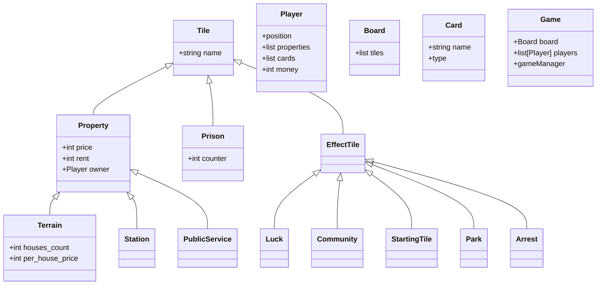

# cw-monopoly-2

```mermaid
classDiagram
	Tile <|-- Property
	Tile <|-- Prison
	Tile <|-- EffectTile
	Tile : +string name

	Prison : +int counter
	
	Property <|-- Terrain
	Property <|-- Station
	Property <|-- PublicService
	Property : +int price
	Property : +int rent
	Property : +Player owner

	Terrain : +int houses_count
	Terrain : +int per_house_price

	EffectTile <|-- Luck
	EffectTile <|-- Community
	EffectTile <|-- StartingTile
	EffectTile <|-- Park
	EffectTile <|-- Arrest

	class Player {
		+position
		+list properties
		+list cards
		+int money
	}
	class Board {
		+list tiles
	}
	class Card {
		+string name
		+type
	}
	class Game {
		+Board board
		+list[Player] players
		+gameManager
	}

```