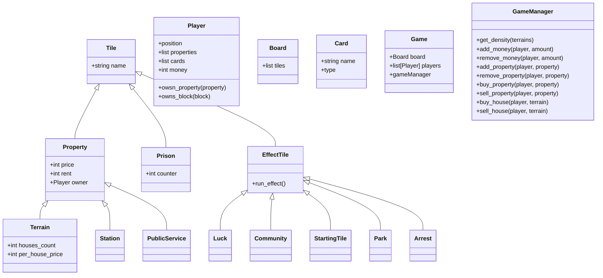

# Coding Weeks - Semaine 2 : Monopoly
Le Monopoly est un jeu de société américain dont le but est de ruiner ses adversaires par des opérations immobilières.

## Présentation des règles

Les présentes règles sont tirées de Wikipedia[^1].

### Déroulement
Le jeu se déroule en tour par tour, avec deux dés ordinaires à 6 faces. Chaque joueur lance les dés, avance son pion sur le parcours, puis selon la case sur laquelle il s'arrête effectue une action correspondante :
- Un **terrain**, une **gare** ou un **service public** n’appartenant à personne : il a alors le droit de l’acheter. S’il n’exerce pas son droit de préemption, le banquier met le terrain aux enchères sans prix de départ prédéfini.
- Un *terrain*, une *gare* ou un *service public* lui appartenant : rien ne se passe.
- Un *terrain*, une *gare* ou un *service public* appartenant à quelque autre joueur : il lui paye la somme due pour une nuitée passée sur ce terrain (si le terrain, la gare ou le *service public* est hypothéqué, le joueur ne paie rien au propriétaire).
- **Case Chance** : il tire une carte Chance. Cette case ne porte pas nécessairement bonne chance : il peut en effet s’agir d’une amende. Chance (en français) est une adaptation de Chance (en anglais) qui signifie plutôt hasard.
- **Case Caisse de Communauté** : il tire une carte Caisse de Communauté (dans les éditions québécoises, celle-ci est appelée Caisse-commune)
- **Case Taxe de luxe** : il en paye le montant à la banque.
- **Case Départ** : il gagne 200 mono, et désormais 400 s'il s'arrête dessus dans l’édition spéciale Monopoly, règles maison22.
- **Case Impôts sur le revenu** : il paye 200 mono à la banque.
- **Case Allez en Prison** : le joueur va directement en prison (en reculant et donc sans passer par la case départ).
- **Case Simple visite** : case neutre où aucune action n’est faite.
- **Case Prison** : il applique les règles pour en sortir, et dans l'édition Monopoly, règles maison, il ne perçoit plus ses loyers.
- **Case Parc gratuit** : case neutre ne rapportant aucun bénéfice au joueur. Une pratique répandue veut que les sommes provenant des impôts et amendes soient posées au milieu du plateau et récupérées par le joueur tombant sur la case Parc gratuit, mais cet usage ne figure pas dans les règles classiques du Monopoly. Une édition spéciale sortie en avril 2014, Monopoly, règles maison, intègre cette pratique dans ses règles.

Les terrains sont groupés par couleur. Dès qu’un joueur est en possession de l’ensemble des terrains d’une même couleur, il est en mesure d’y construire des maisons et des hôtels pour y augmenter le loyer : le joueur possède donc un monopole. Il doit construire uniformément : il ne peut y avoir plus d’une maison de différence entre deux terrains de la même couleur. Pour obtenir un hôtel, il faut d'abord avoir placé 4 maisons sur chaque terrain d'une même couleur. De plus, on ne peut construire qu’un seul hôtel par terrain.

### Prison
Au cours de la partie, le joueur peut se retrouver en prison :

- en s'arrêtant sur la case Allez en prison
- s'il fait un double de dés trois fois de suite (impossibilité d'effectuer toute action après le dernier double)
- s'il pioche la carte Allez en prison

Lorsqu'un joueur est en prison, il pose son pion sur la case Prison. Pendant ce temps, il ne joue pas ; il attend son tour jusqu'à ce qu'il soit libéré, et ne perçoit désormais plus les loyers de ses terrains. Il peut toutefois acheter la carte : Vous êtes libéré de prison à une personne qui la détient ; c'est au vendeur de négocier le tarif.

Le joueur sort de prison :

- s'il détient la carte Vous êtes libéré de prison (il peut soit l'acheter soit l'avoir gardée en réserve lorsqu'il a pioché dans une carte chance ou caisse de communauté) ;
- s'il fait un double de dés ;
- s'il paye une amende de 50 mono (argent du jeu).

Le joueur ne peut rester plus de trois tours en prison. À ce moment-là, s'il ne fait pas de double, il est obligé de payer la caution, ce qui peut le mettre en faillite s'il n'a plus d'argent.

### Fin du jeu
Le vainqueur est le dernier joueur n’ayant pas fait faillite et qui possède de ce fait le monopole (mais en revanche ne dispose plus d’aucun client potentiel).

## Mise en place du projet
Afin de programmer notre version du Monopoly, nous sommes arrivés à la fin d'une phase de réflexion à plusieurs objets clés qui doivent apparaître dans le jeu, et qui sont regroupés dans le diagramme de classes suivant :

[^1]: [Monopoly - Wikipedia](https://fr.wikipedia.org/wiki/Monopoly)